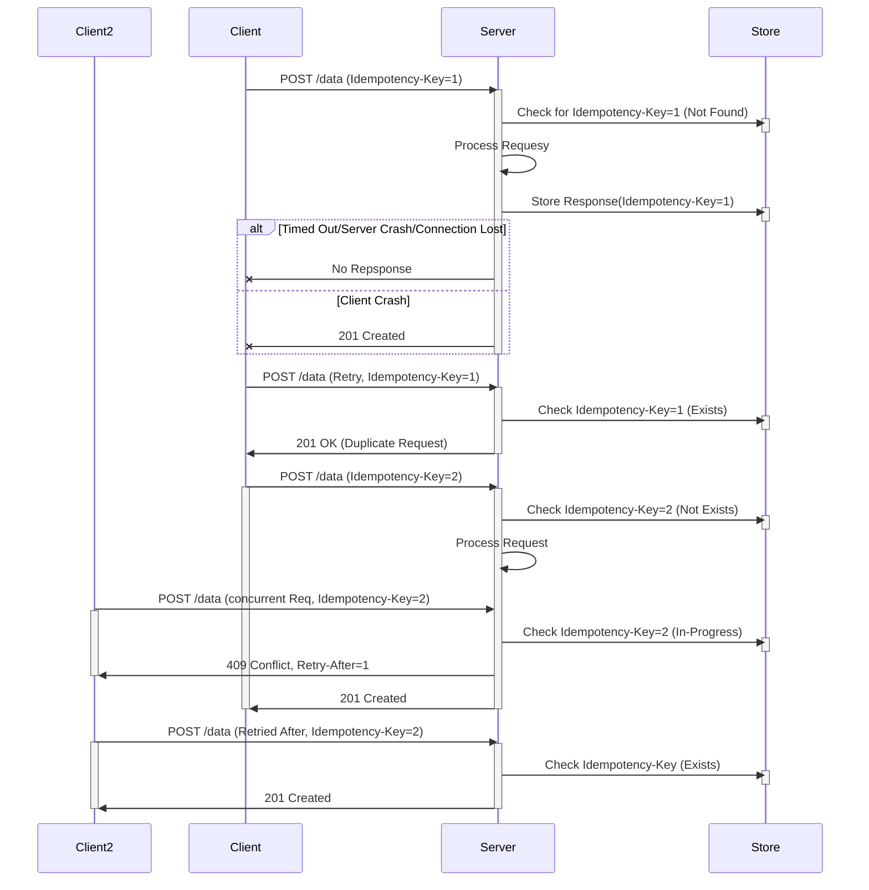

```mermaid
sequenceDiagram
  participant Client2
  participant Client
  participant Server
  Client->>Server: POST /data (Idempotency-Key=1)
  activate Server
  Server->>Store: Check for Idempotency-Key=1 (Not Found)
  activate Store
  deactivate Store
  Server->>Server: Process Requesy
  Server->>Store: Store Response(Idempotency-Key=1)
  activate Store
  deactivate Store
  
  alt Timed Out/Server Crash/Connection Lost
    Server-xClient: No Repsponse
  else Client Crash
    Server-xClient: 201 Created
  end
  deactivate Server

  Client->>Server: POST /data (Retry, Idempotency-Key=1)
  activate Server
  Server->>Store: Check Idempotency-Key=1 (Exists)
  activate Store
  deactivate Store
  Server->>Client: 201 OK (Duplicate Request)
  deactivate Server

  Client->>Server: POST /data (Idempotency-Key=2)
  activate Client
  activate Server
  Server->>Store: Check Idempotency-Key=2 (Not Exists)
  activate Store
  deactivate Store


  Server->>Server: Process Request
  Client2->>Server: POST /data (concurrent Req, Idempotency-Key=2)
  activate Client2
  Server->>Store: Check Idempotency-Key=2 (In-Progress)
  activate Store
  deactivate Store
  Server->>Client2: 409 Conflict, Retry-After=1 
  deactivate Client2

  Server->>Client: 201 Created
  deactivate Server
  deactivate Client

  Client2->>Server: POST /data (Retried After, Idempotency-Key=2)
  activate Client2
  activate Server
  Server->>Store: Check Idempotency-Key (Exists)
  activate Store
  deactivate Store
  Server->>Client2: 201 Created
  deactivate Client2
  deactivate Server
```