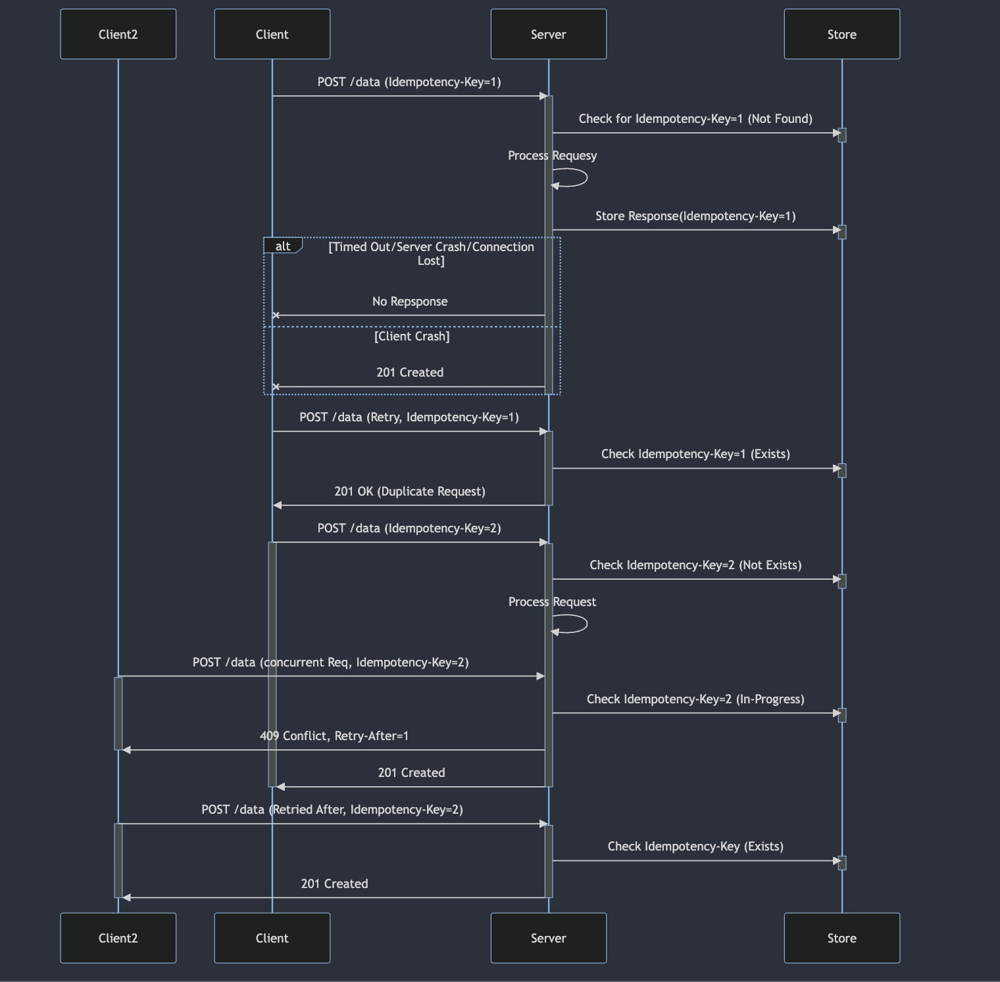

<h3> Node-Idempotency </h3>
<i>makes any request idempotent.</i>

<br/>
<br/>

#### Why?

---

Network requests are unpredictable; clients/proxies may send duplicate or concurrent requests due to retries or network issues. To ensure smooth operation, servers must process each request only once. <i>**This package detects and handles duplicates, preventing issues like double charging the customer**</i>. It's:

- <i>Race Condition free: </i> Ensures consistent behavior even during concurrent requests.
- <i>Modular:</i> Easily integrates with your storage or existing implementation.
- <i>Customizable:</i> options to tweak the library as per your need.
- <i>[RFC](https://datatracker.ietf.org/doc/draft-ietf-httpapi-idempotency-key-header/) compliant: </i> Adheres to standards for compatibility with other systems/clients.

and powers,

- [`@node-idempotency/nestjs`](https://www.npmjs.com/package/@node-idempotency/nestjs) - Plug and Play `nestjs` wrapper for `@node-idempotency/core`

- [`@node-idempotency/express`](https://www.npmjs.com/package/@node-idempotency/express) - Plug and Play `express` middleware for `@node-idempotency/core`

- [`@node-idempotency/fastify`](https://www.npmjs.com/package/@node-idempotency/fastify) - Plug and Play `fastify` plugin for `@node-idempotency/core`

---

#### How?



---

#### @node-idempotency/core

---

if above packages dont meet your needs, you can utilise the core package directly to tweek it as per your needs.

##### install

```bash
npm i @node-idempotency/core
```

##### usage

The flow for idempotency is simple, you call the `onRequest` handler, when you receieve the request from clients before it reaches your business logic/controller.

`onRequest` handler validates request for conflicts, figerprint missmatch, no idempotency-key(when idempotency is enforced) and gives back the response if the key is already seen, you typically give back the "cached" response to the client.

if its a new request, it marks the request as progress generates fingerprint using `body` (so that it can validate conflicts for duplicate requests and figure out fingerprint missmatch), and returns undefined, you are responsible here to pass the request to your controller/business logic.

`onResponse` handler is called by you when your business logic completes for the first time, so that the response can be stored and the request can be marked as complete.

```ts
import { Idempotency } from "@node-idempotency/core";
import { MemoryStorageAdapter } from "@node-idempotency/storage-adapter-memory";

// Create an Idempotency instance using a MemoryStorageAdapter
const idempotency = new Idempotency(new MemoryStorageAdapter(), {
  ...idempotencyOptions,
});

// On receiving a request, call `onRequest` to validate idempotency
try {
  const response = await idempotency.onRequest({
    method: "POST",
    headers: { "idempotency-key": "123" },
    body: { pay: 100 },
    path: "/charge",
    options: { ...idempotencyOptions }, // Optional request-level overrides
  });

  if (!response) {
    // New request, allow it to proceed
    return;
  }

  // Duplicate request, return previous response
  // Example: res.status(response.additional.status).send(response.body)
} catch (err) {
  // Handle idempotency errors (conflict, in-progress, fingerprint mismatch, etc.)
  // Refer to API documentation for specific error codes
}

// Intercept response to complete the idempotency cycle
const response = await idempotency.onResponse(
  {
    method: "POST",
    headers: { "idempotency-key": "123" },
    body: { pay: 100 },
    path: "/charge",
    options: { ...idempotencyOptions }, // Optional request-level overrides
  },
  {
    body: { charge: "success" }, // or error: your_error
    additional: { status: 201 },
  },
);
```

check details about the api [here](./packages/core/docs/classes/Idempotency.md)

<br/>
<hr/>

Other packages in the monorepo are, click on the links to read detailed uses of each repo.

1. [`@node-idempotency/storage`](packages/storage/Readme.md) - `Storage` adapater interface that dictate the storage interface for the `core`.

2. [`@node-idempotency/storage-adapter-memory`](https://github.com/mahendraHegde/node-idempotency/tree/main/packages/storage-adapter-memory) - `In-memory` implementation of `Storage` interface.

3. [`@node-idempotency/storage-adapter-redis`](packages/storage-adapter-redis/Readme.md) - `Redis` implementation of `Storage` interface.

4. [`@node-idempotency/storage-adapter-postgres`](packages/storage-adapter-postgres/Readme.md) - `Postgres` implementation of `Storage` interface.

---

#### Contributing

Read more [here](./Contributing.md)

---

#### Release

1. pnpm changeset
2. commit changes
3. pnpm prepare:publish
4. pnpm publish -r --filter=\!node-idempotency
